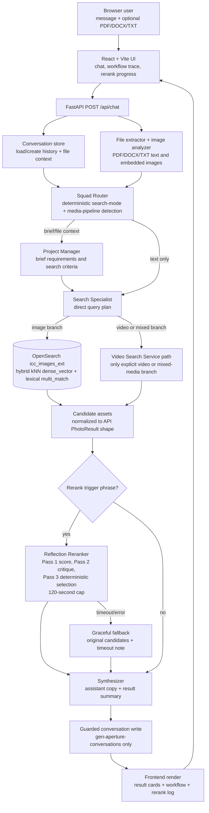

# Gen-Aperture: Agentic Stock Photo Conversational Search

AI-powered conversational interface for searching stock photos using natural language queries and document analysis.

## Features

- 🤖 **Multi-agent search orchestration** — deterministic Squad Router plus LangGraph Project Manager, Search Specialist, Synthesizer, and optional Reflection Reranker
- 💬 **Natural language search** with multi-turn conversation context and stored file context
- 📄 **Document upload** (PDF/DOCX/TXT) for brief-aware searching — extracts text, images, visual requirements, categories, and exclusions
- 🔎 **Direct OpenSearch image retrieval** — app-generated hybrid kNN + lexical queries against `icc_images_ext`
- 🎯 **Reflection Reranking** — 3-pass scoring, critique, and deterministic selection for trigger phrases like "best", "top ranked", "rerank", and "reviewed"
- ⏱️ **Bounded LLM latency** — 30-second Agent Squad LLM calls and a 120-second reranker cap with graceful fallback to original results
- 🔐 **Server-side NVIDIA API key** via `NVIDIA_API_KEY`; user-supplied OpenAI keys are deprecated
- 📊 **Conversation history** with guarded OpenSearch writes and 7-day retention

## Architecture

- **Editable diagram**: [docs/gen-aperture-architecture.excalidraw.json](docs/gen-aperture-architecture.excalidraw.json)
- **Frontend**: React 18 + Vite chat UI with workflow trace, OpenSearch payload viewer, rerank decision log, and frontend-only rerank progress stages
- **Backend**: FastAPI (Python 3.11+) serving `/api/chat`, conversation endpoints, file extraction, image analysis, and static frontend assets when built
- **Agents and LLMs**: LangGraph Agent Squad using NVIDIA NIM OpenAI-compatible chat completions through server-side `NVIDIA_API_KEY`
- **Search and storage**: Aiven OpenSearch using `icc_images_ext` for read-only image search and `gen-aperture-conversations` for guarded conversation writes
- **Optional brief workflow**: `workflow_mode=searchbybrief` runs the SearchByBrief planner/retriever/curator path when its heavier ML dependencies are installed

### OpenSearch Search Flow

Image and document-assisted image search no longer asks Search Service for a base payload. `PhotoSearchService` generates and executes the OpenSearch body directly:

1. Build an OpenAI `text-embedding-3-small` query embedding for the semantic query.
2. Request `256` dimensions so the query vector matches the indexed `dense_vector` field in `icc_images_ext`.
3. Query `icc_images_ext` with an OpenSearch `hybrid` query:
   - kNN over `dense_vector`, using `OPENSEARCH_KNN_MIN_SCORE` when positive or `OPENSEARCH_KNN_K` top-k retrieval when set to `0`
   - lexical `multi_match` over `title`, `description`, `tags`, and `photographer`
   - optional text exclusions and only filters supported by the current index
4. Run the query through the `reveal-hybrid` search pipeline.
5. Map `icc_images_ext` fields (`image_id`, URLs, `tags`, `photographer`, dimensions) into the existing frontend result shape.
6. Keep the generated payload and redacted target URL in the workflow trace for inspection.

Explicit video and mixed video searches still use the video search service path.

## Agent Pipeline



### Latency and fallback behavior

- Text-only search-mode detection is deterministic; the router does not spend an LLM call to decide `relevance` versus `popular`.
- Agent Squad `ChatOpenAI` calls use `AGENT_LLM_TIMEOUT_SECONDS` (default `30`) and `AGENT_LLM_MAX_RETRIES` (default `0`).
- Reflection reranking uses `RERANK_MODEL` (default `meta/llama-3.2-3b-instruct`) and is capped by `RERANK_TIMEOUT_SECONDS` (default `120`).
- If reranking times out or errors, the chat response still completes with the original search results and a short reranking note.
- The in-flight rerank progress panel is frontend-only because `/api/chat` is a single POST response, not a streaming/job-status API.

### Reflection Reranker — trigger phrases

| User says… | Triggers reranking? |
|---|---|
| "best results", "best matching photos" | ✅ |
| "top ranked", "top-ranked" | ✅ |
| "rerank" | ✅ |
| "reflect and respond" | ✅ |
| "reviewed picks" | ✅ |
| "find a sunset photo" | ❌ |

## Quick Start

### Prerequisites

- Python 3.11+
- Node.js 18+
- Access to internal OpenSearch cluster
- NVIDIA API key configured in `backend/.env`

### Development Setup

1. **Clone and setup environment:**
```bash
cd gen-aperture
cp backend/.env.example backend/.env  # edit as needed
```

2. **Start backend:**
```bash
cd backend
python -m venv venv
source venv/bin/activate  # On Windows: venv\Scripts\activate
pip install -r requirements.txt
uvicorn app.main:app --reload
```

Backend runs on http://localhost:8000

3. **Start frontend (new terminal):**
```bash
cd frontend
npm install
npm run dev
```

Frontend runs on http://localhost:5173

4. **Open browser** → http://localhost:5173 → start chatting

### Using Docker Compose

```bash
docker-compose up
```

Access at http://localhost:5173

## Project Structure

```
gen-aperture/
├── backend/
│   ├── app/
│   │   ├── main.py                    # FastAPI application entry point
│   │   ├── config.py                  # NVIDIA, OpenSearch, timeout, and reranker settings
│   │   ├── routers/
│   │   │   ├── chat.py                # POST /api/chat endpoint
│   │   │   └── conversations.py       # Conversation list/read/delete endpoints
│   │   ├── services/
│   │   │   ├── agent_squad.py         # LangGraph multi-agent orchestrator
│   │   │   ├── reranker.py            # Reflection reranker (3-pass pipeline)
│   │   │   ├── photo_search.py        # Direct OpenSearch hybrid image query execution
│   │   │   ├── search_service_mcp.py  # Legacy/optional Search Service helper
│   │   │   ├── video_search_mcp.py    # Video search service path
│   │   │   ├── query_refinement.py    # Query refinement helpers and legacy filter parsing
│   │   │   ├── query_intent.py        # Query intent helpers and fallbacks
│   │   │   ├── category_filter.py     # Category GID mapping
│   │   │   ├── file_extractor.py      # PDF/DOCX/TXT text extraction
│   │   │   ├── conversation_store.py  # OpenSearch conversation persistence
│   │   │   ├── opensearch_guardrails.py # Read-only safety enforcement
│   │   │   └── searchbybrief/         # Optional brief planner/retriever/curator workflow
│   │   └── models/
│   │       └── schemas.py             # Pydantic request/response schemas
│   └── requirements.txt
├── frontend/
│   ├── src/
│   │   ├── App.jsx                    # Chat UI, workflow panel, rerank log
│   │   ├── services/api.js            # Axios API client
│   │   └── index.css                  # Styles including rerank panel
│   └── package.json
├── briefs/                            # Sample creative briefs for testing
├── docs/
│   ├── gen-aperture-architecture.excalidraw.json # Editable architecture diagram
│   └── plans/                         # Task plans and implementation notes
├── design.md                          # Current architecture specification
├── QUICKSTART.md                      # Local run and smoke-test guide
├── .github/copilot-instructions.md    # AI agent guidance
└── docker-compose.yml
```

## Runtime Workflow

1. The frontend sends a multipart `POST /api/chat` request with a message, optional `conversation_id`, optional file, optional model override, and workflow mode.
2. The backend extracts uploaded file text/images and loads prior conversation history plus stored file context.
3. Agent Squad detects search mode and media pipeline. Image paths use the direct `icc_images_ext` hybrid query path; explicit video or mixed-media queries still branch to the video service path.
4. Optional reflection reranking runs only for trigger phrases and can fall back to the original candidates after its timeout.
5. The synthesizer returns assistant copy, normalized result cards, workflow steps, optional rerank decisions, and timing metadata.
6. Conversation writes go only through the guarded `gen-aperture-conversations` path.

## API Endpoints

### POST /api/chat
Send message and get AI response with photo results.
```bash
curl -X POST http://localhost:8000/api/chat \
  -F "message=Find the best outdoor sunset photos" \
  -F "file=@brief.pdf"
```

Optional multipart fields:

- `conversation_id`: continue an existing conversation
- `workflow_mode`: `agent_squad` by default, or `searchbybrief` when the optional SearchByBrief workflow is installed
- `model`: NVIDIA model override for the Agent Squad path

Response includes standard fields plus reranker output when triggered:
```json
{
  "conversation_id": "...",
  "response": "Here are the top results…",
  "results": [...],
  "search_mode": "relevance",
  "workflow_steps": [...],
  "rerank_applied": true,
  "rerank_decisions": [
    {"final_rank": 1, "hadron_id": "h001", "rerank_score": 0.97,
     "keep": true, "is_borderline": false,
     "reason": "Directly depicts golden ocean sunset.", "confidence": 0.97}
  ],
  "rerank_explanation": null
}
```

### GET /api/conversations/recent
List last 5 conversations

### GET /api/conversations/{id}
Get full conversation with messages

### DELETE /api/conversations/{id}
Delete one conversation from the guarded conversation index

### GET /health
Health check

## Configuration

Backend environment variables (`backend/.env`):
```
OPENSEARCH_ENDPOINT=http://localhost:9200
OPENSEARCH_USERNAME=...
OPENSEARCH_PASSWORD=...
OPENSEARCH_PHOTO_INDEX=icc_images_ext
OPENSEARCH_HYBRID_SEARCH_PIPELINE=reveal-hybrid
OPENSEARCH_VECTOR_FIELD=dense_vector
OPENSEARCH_KNN_K=200
# Above zero uses radial kNN search and drops distant vector neighbors before hybrid blending.
# Set to 0 to fall back to top-k vector retrieval.
OPENSEARCH_KNN_MIN_SCORE=0.58
OPENSEARCH_TEXT_EMBEDDING_MODEL=text-embedding-3-small
OPENSEARCH_TEXT_EMBEDDING_DIMENSIONS=256
OPENSEARCH_TEXT_EMBEDDING_TIMEOUT_SECONDS=15
OPENSEARCH_CONVERSATION_ENDPOINT=http://localhost:9200
OPENSEARCH_CONVERSATION_INDEX=gen-aperture-conversations
OPENSEARCH_CONVERSATION_MAX_RECORDS=5000
OPENSEARCH_CONVERSATION_MAX_STORE_BYTES=5368709120
# Optional override; unset uses host-based read-only detection.
OPENSEARCH_READONLY=true
SESSION_TIMEOUT_MINUTES=30
ENVIRONMENT=development

# NVIDIA LLM (required key; defaults shown)
NVIDIA_API_KEY=...
NVIDIA_BASE_URL=https://integrate.api.nvidia.com/v1
AGENT_MODEL=meta/llama-3.3-70b-instruct
AGENT_MODEL_BASE_URL=
AGENT_FALLBACK_MODEL=
AGENT_LLM_TIMEOUT_SECONDS=30
AGENT_LLM_MAX_RETRIES=0
TEXT_QUERY_INTENT_LLM_ENABLED=false
IMAGE_ANALYSIS_MODEL=meta/llama-3.2-11b-vision-instruct

# OpenAI query embeddings for direct icc_images_ext search
OPENAI_API_KEY=...

# Optional SearchByBrief retriever settings
SEARCHBYBRIEF_MODEL=meta/llama-3.3-70b-instruct
SEARCHBYBRIEF_RETRIEVER_CLIP_MODEL=ViT-B/32
SEARCHBYBRIEF_RETRIEVER_CLIP_DOWNLOAD_ROOT=/tmp/clip

# Reflection reranker thresholds (all optional — defaults shown)
RERANK_MIN_RESULTS_TARGET=10
RERANK_RELEVANCE_THRESHOLD=3.0
RERANK_BORDERLINE_THRESHOLD=2.0
RERANK_DUPLICATE_SIMILARITY_THRESHOLD=0.5
# Reflection reranker model and hard cap (optional)
RERANK_MODEL=meta/llama-3.2-3b-instruct
RERANK_TIMEOUT_SECONDS=120
```

## Security

- ⚠️ `NVIDIA_API_KEY` stays server-side in `backend/.env`
- ⚠️ `OPENAI_API_KEY` stays server-side in `backend/.env` and is used only for direct OpenSearch query embeddings
- OpenSearch cluster is read-only for the photo index
- Conversation writes are allowed only to `gen-aperture-conversations`
- Conversation writes are rejected at 5000 records or 5 GB index store size
- 6MB file upload limit
- 7-day conversation retention
- The OpenSearch workflow panel redacts credentials from displayed endpoint URLs
- Deprecated `openai_api_key` request fields are accepted for compatibility but are not used for LLM calls


## Documentation

- [design.md](design.md) — Current architecture specification
- [docs/gen-aperture-architecture.excalidraw.json](docs/gen-aperture-architecture.excalidraw.json) — Editable Excalidraw architecture diagram
- [QUICKSTART.md](QUICKSTART.md) — Local startup and smoke-test guide
- [docs/plans/](docs/plans/) — Task plans and implementation notes for architecture changes
- [.github/copilot-instructions.md](.github/copilot-instructions.md) — AI coding guidelines
- [REVIEW.md](REVIEW.md) — Design review summary
- [PHASE1-COMPLETE.md](PHASE1-COMPLETE.md) — Phase 1 completion notes

https://rajanim.github.io/agent-search-patterns/
