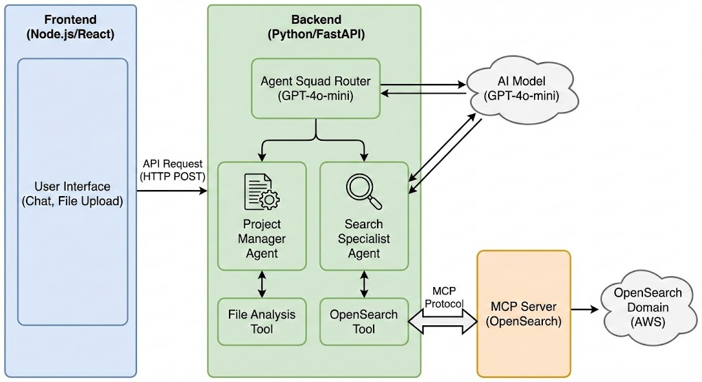
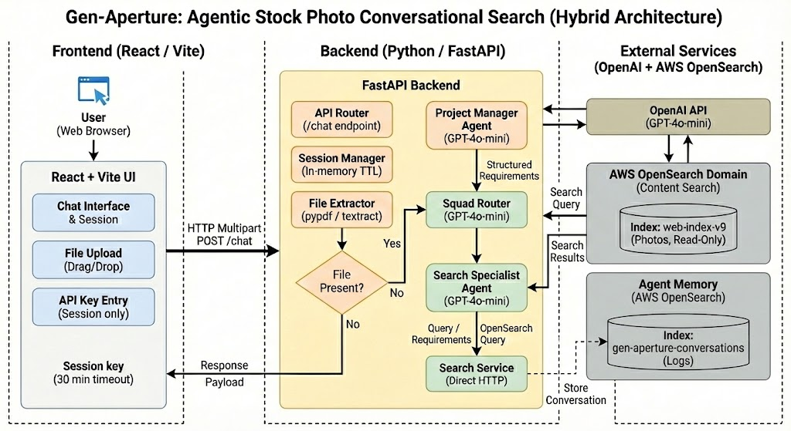

# Gen-Aperture: Agentic Stock Photo Conversational Search

## Executive Summary

This document outlines the technical architecture for a conversational search interface for stock photo discovery. The system replaces traditional keyword search with an intelligent chat interface that understands natural language queries and analyzes uploaded project briefs (PDFs, DOCX, TXT).

**Key Features:**
- Natural language conversational search
- Document upload for context-aware searching (PDF/DOCX/TXT, 1MB limit)
- Multi-turn conversations with full context retention
- Multi-agent orchestration for requirement analysis and search execution
- 7-day conversation history persistence in OpenSearch

---

## System Architecture


### Technology Stack

| Component | Technology | Rationale |
|-----------|-----------|-----------|
| **Frontend** | React 18 + Vite | Modern, fast development with HMR |
| **Backend** | FastAPI (Python 3.11+) | Async-native, excellent for AI workloads |
| **Agent Framework** | LangGraph | Production-ready multi-agent orchestration |
| **LLM** | OpenAI GPT-4o-mini | Cost-effective reasoning engine |
| **Search Database** | OpenSearch 3.3 | Existing photo index (`web-index-v9`) |
| **Conversation Storage** | OpenSearch (custom index) | Leverage existing infrastructure |
| **File Processing** | pypdf, python-docx | Native Python document extraction |
| **Deployment** | Docker + Backstage FastAPI template | Single container deployment |

### Deployment Model

**Single Python Application** (FastAPI serves both API and static frontend):
```
Docker Container
├── FastAPI Backend (port 8000)
│   ├── /api/chat          → Chat endpoint
│   ├── /api/conversations → History retrieval
│   └── /                  → Serves React static files
└── React Frontend (compiled to /static/)
```

**Benefits:**
- Single deployment artifact
- No CORS issues
- Simpler operations
- Fits Backstage FastAPI template

---
## Workflow 

## Core Components

### 1. Frontend (React + Vite)

**Location:** `/frontend/`

**Key Components:**
- **ChatInterface**: Main conversation area, message stream
- **MessageInput**: Text input + file upload (drag-drop support)
- **SessionSidebar**: Current conversation history, new chat button
- **FilePreview**: Shows uploaded file name/size before sending

**State Management:**
- React Context for conversation state
- Session storage for conversation_id and OpenAI API key (30-min expiry)
- Optimistic UI updates

**Key Features:**
- **New Chat Button**: Creates fresh conversation, clears current context
- **Session Sidebar**: Shows last 5 conversations with preview (last query)
- **API Key Modal**: Prompts on first load or session expiry
- **File Upload**: Drag-drop or picker, shows preview before submission (Option C)

**API Communication:**
```javascript
// POST /api/chat (first message in new conversation)
{
  message: "Find outdoor photos",
  conversation_id: null,  // Backend will create
  openai_api_key: "sk-...",  // Required on first message
  file: File (optional, max 1MB)
}

// POST /api/chat (subsequent messages)
{
  message: "Show more outdoor shots",
  conversation_id: "uuid-here",  // Existing conversation
  file: null
}

// Response
{
  conversation_id: "uuid-here",
  response: "Here are 15 outdoor photos...",
  results: [
  - `message`: User query (required)
  - `conversation_id`: UUID or null for new conversation (optional)
  - `openai_api_key`: Required if new conversation or session expired (optional)
  - `file`: PDF/DOCX/TXT, max 1MB (optional)
- **Processing:**
  1. Validate/store OpenAI API key in session (30-min timeout)
  2. Load conversation history from OpenSearch (if existing)
  3. Extract text from uploaded file if present (store at conversation level)
  4. Pass to Agent Squad with full context
  5. Store message exchange in OpenSearch
  6. Return response + results
- **Response Time:** 2-4s (text only), 5-8s (with file)
- **Error Handling:**
  - 401 if API key invalid/expired
  - 413 if file > 1MB
  - 400 if unsupported file type
  - 503 if OpenAI/OpenSearch unavailable

#### `GET /api/conversations/{conversation_id}`
Retrieve full conversation
- Returns all messages with file context
- Used on page refresh to restore conversation

#### `GET /api/conversations/recent`
List recent conversations for sidebar
- Returns last 5 conversations
- Each with: conversation_id, last_user_query, last_message_at, message_count
- Sorted by most recent first

#### `POST /api/conversations/new`
Create new conversation
- Validates OpenAI API key
- Creates session with 30-min expiry

**Location:** `/backend/`

**Endpoints:**

#### `POST /api/chat`
Main conversation endpoint
- **Input:** `multipart/form-data` (message, conversation_id, optional file)
- **Processing:**
  1. Load conversation history from OpenSearch
  2. Extract text from uploaded file (if present)
  3. Pass to Agent Squad with full context
  4. Store exchange in OpenSearch
  5. Return response + conversation_id
- **Response Time:** 2-4s (text only), 5-8s (with file)

#### `GET /api/conversations/{conversation_id}`
Retrieve conversation history
- Returns all messages in chronological order
- Used on page refresh to restore context

#### `POST /api/conversations`
Create new conversation
- Generates UUID, creates entry in OpenSearch
- Returns conversation_id

#### `GET /` and `/assets/*`
Serve compiled React frontend

---

### 3. Agent Squad (LangGraph Multi-Agent System)

**Location:** `/backend/app/agents/`

#### Architecture Pattern: Conditional Routing Graph

```python
from langgraph.graph import StateGraph
from typing import TypedDict, Optional, List

class ConversationState(TypedDict):
    conversation_id: str
    message: str
    history: List[dict]
    file_content: Optional[str]
    extracted_requirements: Optional[str]
    search_results: Optional[List[dict]]
    final_response: str

workflow = StateGraph(ConversationState)
```

#### Agent Definitions

**1. Router (Entry Point)**
- **Role:** Intelligent dispatcher
- **Logic:** 
  - If `file_content` exists → Route to Project Manager
  - If query references past context (history) → Route to Search Specialist with context
  - Otherwise → Route to Search Specialist directly
- **No LLM call:** Simple conditional logic

**2. Project Manager Agent**
- **Role:** Requirements Analyst
- **Input:** Uploaded document text
- **Tools:** None (analysis only)
- **Prompt:**
  ```
  Analyze this project brief and extract:
  - Visual themes (colors, moods, styles)
  - Required subjects (people, objects, settings)
  - Negative constraints (what to avoid)
  - Technical requirements (aspect ratio, orientation)
  
  Format as structured search requirements.
  ```
- **Output:** `extracted_requirements` (refined search query)
- **Handoff:** Always passes to Search Specialist

**3. Search Specialist Agent**
- **Role:** Technical Database Expert
- **Input:** Refined requirements OR direct user query
- **Tools:** `opensearch_search_tool`
- **Responsibilities:**
  - Translate natural language to OpenSearch query
  - Execute search via tool
  - Interpret JSON results
  - Format user-friendly response with image metadata
- **Prompt:**
  ```
  You are an expert at searching a stock photo database.
  Given user requirements, construct precise OpenSearch queries.
  Present results conversationally with titles, descriptions, and IDs.
  ```

#### Agent Flow Examples

**Scenario A: Text-Only Query**
```
User: "candid photos of people laughing outside"
  ↓
Router → Search Specialist
  ↓
OpenSearch Tool → web-index-v9
  ↓
Results formatted → User
```

**Scenario B: Document Upload**
```
User: [uploads marketing_brief.pdf] "find images for this"
  ↓
File extracted → "warm lighting, diverse team, tech office"
  ↓
Router → Project Manager
  ↓
PM extracts: "office setting, diverse professionals, warm tones, collaborative"
  ↓
Search Specialist receives refined query
  ↓
OpenSearch Tool → web-index-v9
  ↓
Results formatted → User
```

**Scenario C: Multi-Turn Conversation**
```
Turn 1: "Find modern office photos"
  → Returns 10 results
  
Turn 2: "Show me ones with natural lighting"
  ↓
Search Specialist receives:
  - Current message: "Show me ones with natural lighting"
  - History: Previous query about modern offices
  ↓
Understands context: "modern office + natural lighting"
  ↓
Refined search executed
```

---

### 4. OpenSearch Integration

#### Photo Index (Read-Only)
**Endpoint:** `http://mmr-test-v1-prod.sstk-search-prod.ct.shuttercloud.org`  
**Index:** `web-index-v9`  
**Access:** Direct HTTP (no credentials, internal network)

**Actual Schema (web-index-v9):**
```json
{
  "hadron_id": "38JS2PF05X9RHCF7ZS7T3WRNYR",
  "ext_id": 2081391682,
  "description_en": "green grass at seashore zoom hd 1080i",
  "keywords_en": ["green", "nature", "seasonal", ...],
  "date_added": "2006-11-11T00:00:00Z",
  "total_paid_license_count_all_time": 0,
  "media_type": "video" | "photo",
  "is_photo": true,
  "orientation": "horizontal" | "portrait" | "square",
  "contributor_name": "Zygista",
  "engagement_score": 0.147,
  "titan_video_txt_vector": [768-dim array]
}
```

**Image URL Construction:**
```python
def build_image_url(ext_id: int) -> str:
    return f"https://image.shutterstock.com/image-photo/image-250nw-{ext_id}.jpg"
```

**Search Strategy:**
```python
# Multi-match query for natural language
{
  "query": {
    "bool": {
      "must": [
        {
          "multi_match": {
            "query": "outdoor candid laughing people",
            "fields": ["description_en^2", "keywords_en^1.5"],
            "type": "best_fields"
          }
        }
      ],
      "filter": [
        {"term": {"media_type": "photo"}},
        {"term": {"is_photo": true}}
      ]
    }
  },
  "sort": [
    {"engagement_score": {"order": "desc"}},
    "_score"
  ],
  "size": 15
}
```

**Result Format (returned to frontend):**
```json
{
  "hadron_id": "38JS2PF05X9RHCF7ZS7T3WRNYR",
  "ext_id": 2081391682,
  "description": "green grass at seashore zoom hd 1080i",
  "date_added": "2006-11-11T00:00:00Z",
  "impressions": 0,
  "image_url": "https://image.shutterstock.com/image-photo/image-250nw-2081391682.jpg"
}
```

#### Conversation Index (Read-Write)

**Index Name:** `gen-aperture-conversations`

**Mapping:**
```json
{
  "mappings": {
    "properties": {
      "conversation_id": { "type": "keyword" },
      "created_at": { "type": "date" },
      "last_message_at": { "type": "date" },
      "last_user_query": { "type": "text" },
      "message_count": { "type": "integer" },
      "file_name": { "type": "keyword" },
      "file_content": { "type": "text", "index": false },
      "messages": {
        "type": "nested",
        "properties": {
          "message_number": { "type": "integer" },
          "timestamp": { "type": "date" },
          "user_message": { "type": "text" },
          "agent_response": { "type": "text" },
          "search_results_count": { "type": "integer" },
          "processing_time_ms": { "type": "integer" }
        }
      }
    }
  },
  "settings": {
    "index": {
      "lifecycle": {
        "name": "7day_retention_policy"
      }
    }
  }
}
```

**Lifecycle Policy (7-Day Retention):**
```json
PUT _plugins/_ism/policies/7day_retention_policy
{
  "policy": {
    "description": "Delete conversations after 7 days",
    "default_state": "active",
    "states": [
      {
        "name": "active",
        "actions": [],
        "transitions": [
          {
            "state_name": "delete",
            "conditions": {
              "min_index_age": "7d"
            }
          }
        ]
      },
      {
        "name": "delete",
        "actions": [
          {
            "delete": {}
          }
        ]
      }
    ]
  }
}
```

**Conversation Storage Implementation:**
```python
# backend/app/services/conversation_store.py
from opensearchpy import OpenSearch
from datetime import datetime
import uuid

class ConversationStore:
    def __init__(self):
        self.client = OpenSearch(
            hosts=[{, file_name: str = None, file_content: str = None) -> str:
        """Create new conversation"""
        conversation_id = str(uuid.uuid4())
        doc = {
            'conversation_id': conversation_id,
            'created_at': datetime.utcnow().isoformat(),
            'last_message_at': datetime.utcnow().isoformat(),
            'last_user_query': '',
            'message_count': 0,
            'file_name': file_name,
            'file_content': file_content,  # Stored once at conversation level
            'messages': []
        }
        self.client.index(index=self.index, id=conversation_id, body=doc)
        return conversation_id
    
    async def add_message(self, conversation_id: str, user_msg: str, 
                          agent_response: str, metadata: dict):
        """Append message to conversation"""
        # Get existing conversation
        doc = self.client.get(index=self.index, id=conversation_id)
        conversation = doc['_source']
        
        # Append new message
        new_message = {
            'message_number': conversation['message_count'] + 1,
            'timestamp': datetime.utcnow().isoformat(),
            'user_message': user_msg,
            'agent_response': agent_response,
            'search_results_count': metadata.get('results_count', 0),
            'processing_time_ms': metadata.get('processing_time_ms', 0)
        }
        
        conversation['messages'].append(new_message)
        conversation['message_count'] += 1
        conversation['last_message_at'] = new_message['timestamp']
        conversation['last_user_query'] = user_msg
        
        # Update document
        self.client.update(
            index=self.index,
            id=conversation_id,
            body={'doc': conversation}
        )
    
    async def get_conversation(self, conversation_id: str) -> dict:
        """Retrieve full conversation"""
        doc = self.client.get(index=self.index, id=conversation_id)
        return doc['_source']
    
    async def list_recent_conversations(self, limit: int = 5) -> List[dict]:
        """Get recent conversations for sidebar"""
        query = {
            "query": {"match_all": {}},
            "sort": [{"last_message_at": {"order": "desc"}}],
            "size": limit,
            "_source": ["conversation_id", "last_user_query", "last_message_at", "message_count"]
        }"""Retrieve conversation history"""
        query = {
            "query": {
                "term": {"conversation_id": conversation_id}
            },
            "sort": [{"message_number": "asc"}],
            "size": limit
        }
        
        result = self.client.search(index=self.index, body=query)
        return [hit['_source'] for hit in result['hits']['hits']]
```

---

## Multi-Turn Conversation Strategy

### Context Window Management

**Approach:** Full history in LLM context (GPT-4o-mini has 128K context window)

**For each request:**
1. Frontend sends: `{message, conversation_id}`
2. Backend loads conversation history from OpenSearch
3. Constructs LLM context:
   ```python
   context = [
       {"role": "system", "content": agent_system_prompt},
       {"role": "user", "content": history[0].user_message},
       {"role": "assistant", "content": history[0].agent_response},
       # ... all previous turns
       {"role": "user", "content": current_message}
   ]
   ```
4. Agent processes with full context
5. New exchange stored back to OpenSearch

**Cost Analysis (10 RPS):**
- Average conversation: 5 turns = 10 messages
- Average tokens per conversation: ~5,000 tokens
- GPT-4o-mini cost: $0.150/1M input tokens = $0.00075 per request
- At 10 RPS sustained: ~$25/day in LLM costs

**Optimization:** If conversations exceed 20 turns, use summarization:
```python
if len(history) > 20:
    # Summarize turns 1-15, keep last 5 verbatim
    summary = llm.summarize(history[:15])
    context = [system_prompt, summary] + history[15:]
```

---

## Performance Specifications

### Throughput Requirements
- **Target:** 10 requests/second sustained
- **Peak:** 20 requests/second burst (2x capacity)

### Latency Targets
- **Text-only query:** 2-4 seconds (90th percentile)
- **With file upload:** 5-8 seconds (90th percentile)
- **File extraction:** <2 seconds (1MB PDF)

### Scalability
**Single FastAPI instance (4 CPU cores):**
- Can handle 80-100 concurrent requests
- Async I/O for OpenSearch and OpenAI calls
- File processing in asyncio task pool

**Bottlenecks:**
1. OpenAI API rate limits (check tier, typically 3,500 RPM for Tier 3)
2. File upload processing (memory for concurrent PDFs)
3. OpenSearch query performance

**Mitigation:**
- Request queuing if OpenAI rate limit hit
- Stream responses for better perceived performance
- Cache OpenSearch schema/mapping

---

## Data Flow Diagram

```
┌─────────────┐
│   Browser   │
│  (React UI) │
└──────┬──────┘
       │ POST /api/chat
       │ {message, conversation_id, file?}
       ↓
┌─────────────────────────────────────┐
│        FastAPI Backend              │
│  ┌───────────────────────────────┐ │
│  │ 1. Load history from OpenSearch│ │
│  └──────────┬────────────────────┘ │
│             ↓                       │
│  ┌───────────────────────────────┐ │
│  │ 2. Extract file text (if any) │ │
│  └──────────┬────────────────────┘ │
│             ↓                       │
│  ┌───────────────────────────────┐ │
│  │ 3. Pass to Agent Squad        │ │
│  │    (LangGraph Workflow)       │ │
│  └──────────┬────────────────────┘ │
└─────────────┼───────────────────────┘
              │
    ┌─────────┴─────────┐
    │                   │
    API Key Management ⚠️ **USER-PROVIDED**

**Critical Design Decision:** OpenAI API keys are **NEVER stored** on the server.

**Flow:**
1. User opens app → Prompted for OpenAI API key on first interaction
2. API key stored in **backend session memory** (30-minute timeout)
3. Each request includes `conversation_id` (linked to session with API key)
4. After 30 minutes of inactivity → Session expires, API key deleted from memory
5. User must re-enter API key to continue

**Implementation:**
```python
# In-memory session store (or Redis for multi-instance)
from datetime import datetime, timedelta

sessions = {
    "conversation_id": {
        "api_key": "sk-...",
        "last_activity": datetime,
        "expires_at": datetime
    }
}

def get_api_key(conversation_id: str) -> Optional[str]:
    session = sessions.get(conversation_id)
    if not session:
        return None
    
    if datetime.utcnow() > session['expires_at']:
        # Expired - delete
        del sessions[conversation_id]
        return None
    
    # Update last activity, extend expiry
    session['last_activity'] = datetime.utcnow()
    session['expires_at'] = datetime.utcnow() + timedelta(minutes=30)
    return session['api_key']
```

**Security Benefits:**
- No API keys in environment variables
- No API keys in logs or databases
- No API keys in Backstage configuration
- Users responsible for their own OpenAI usage/billing
- Automatic cleanup on inactivity

**API Request Flow:**
```
Frontend → POST /api/chat
{
  "conversation_id": "uuid",
  "message": "find photos",
  "openai_api_key": "sk-..." (only if first message or expired)
}
```

### Internal-Only Deployment
- No public internet exposure
- Deployed within ShutterCorp internal network
- OpenSearch accessible without authentication (internal trust)

### Data Retention
- **Conversations:** 7 days in OpenSearch, then auto-deleted
- **Uploaded files:** Extracted text stored in conversation index, original files not persisted
- **API Keys:** In memory only, 30-minute timeout, never persisted
- **No PII collection:** Internal employee use only

### File Upload Security
- **Max size:** 1MB (enforced at FastAPI level)
- **Allowed types:** PDF, DOCX, TXT (validated by MIME type)
- **Virus scanning:** Not implemented (internal trust model)
- **Temporary storage:** In-memory processing, no disk writes
- **Validation:** File preview shown before extraction (Option C)
    ┌──────────────────┐      ┌─────────────────┐
    │  Photo Search    │      │  Store Message  │
    │  Results         │      │  in Conversation│
    │  (15 images)     │      │  Index          │
    └────────┬─────────┘      └─────────────────┘
             │
             ↓
    ┌──────────────────┐
    │   Formatted      │
    │   Response       │
    │   to User        │
    └──────────────────┘
```

---

## Security & Privacy

### Internal-Only Deployment
- No public internet exposure
- Deployed within ShutterCorp internal network
- OpenSearch accessible without authentication (internal trust)

### Data Retention
- **Conversations:** 7 days in OpenSearch, then auto-deleted
- **Uploaded files:** Extracted text stored in conversation index, original files not persisted
- **No PII collection:** Internal employee use only

### File Upload Security
- **Max size:** 1MB (enforced at FastAPI level)
- **Allowed types:** PDF, DOCX, TXT (validated by MIME type)
- **Virus scanning:** Not implemented (internal trust model)
- **Temporary storage:** In-memory processing, no disk writes

---

## Deployment Architecture

### Backstage FastAPI Template

**Repository:** `https://github.shuttercorp.net/backstage/templates/tree/main/add-gha-app-fastapi/`

**Project Structure:**
```
gen-aperture/
├── .github/
│   ├── copilot-instructions.md
│   └── workflows/
│       └── deploy.yml              # CI/CD pipeline
├── frontend/
│   ├── src/
│   │   ├── components/
│   │   │   ├── ChatInterface.jsx
│   │   │   ├── MessageInput.jsx
│   │   │   ├── SessionSidebar.jsx
│   │   │   └── FileUpload.jsx
│   │   ├── services/
│   │   │   └── api.js
│   │   ├── App.jsx
│   │   ├── main.jsx
│   │   └── index.css
│   ├── public/
│   ├── index.html
│   ├── package.json
│   ├── vite.config.js
│   └── .env.development         # VITE_API_URL=http://localhost:8000
├── backend/
│   ├── app/
│   │   ├── main.py              # FastAPI app + static serving
│   │   ├── routers/
│   │   │   ├── chat.py          # POST /api/chat
│   │   │   └── conversations.py # Conversation management
│   │   ├── agents/
│   │   │   ├── squad.py         # LangGraph workflow
│   │   │   ├── project_manager.py
│   │   │   └── search_specialist.py
│   │   ├── tools/
│   │   │   └── opensearch_search.py
│   │   ├── services/
│   │   │   ├── conversation_store.py
│   │   │   └── file_extractor.py
│   │   └── models/
│   │       └── schemas.py       # Pydantic models
│   ├── static/                  # Compiled React app (CI/CD copies here)
│   ├── requirements.txt
│   ├── Dockerfile
│   └── .env                     # OPENAI_API_KEY, OPENSEARCH_ENDPOINT
├── docker-compose.yml           # Local development
├── README.md
└── DESIGN.md                    # This file
```

### Dockerfile (Production)

```dockerfile
FROM python:3.11-slim

WORKDIR /app

# Install system dependencies for PDF processing
RUN apt-get update && apt-get install -y \
    libmagic1 \
    && rm -rf /var/lib/apt/lists/*

# Install Python dependencies
COPY backend/requirements.txt .
RUN pip install --no-cache-dir -r requirements.txt

# Copy backend application
COPY backend/app ./app

# Copy pre-built frontend (from CI/CD step)
COPY backend/static ./app/static

# Environment variables (overridden in deployment)
ENV OPENAI_API_KEY=""
ENV OPENSEARCH_ENDPOINT="http://mmr-test-v1-prod.sstk-search-prod.ct.shuttercloud.org"
ENV ENVIRONMENT="production"

EXPOSE 8000

# Run with 4 workers for 10 RPS capacity
CMD ["uvicorn", "app.main:app", "--host", "0.0.0.0", "--port", "8000", "--workers", "4"]
```

### CI/CD Pipeline (.github/workflows/deploy.yml)

```yaml
name: Build and Deploy

on:
  push:
    branches: [main]

jobs:
  build-and-deploy:
    runs-on: ubuntu-latest
    steps:
      - uses: actions/checkout@v3
      
      # Build frontend
      - name: Build React Frontend
        working-directory: ./frontend
        run: |
          npm ci
          npm run build
          
      # Copy to backend static directory
      - name: Copy Frontend Build
        run: |
          mkdir -p backend/static
          cp -r frontend/dist/* backend/static/
      
      # Build Docker image
      - name: Build Docker Image
        run: |
          docker build -t gen-aperture:${{ github.sha }} .
          
      # Push to registry & deploy (Backstage handles this)
      - name: Deploy via Backstage
        run: |
          # Backstage template deployment logic
```

### Local Development Setup

```bash
# Terminal 1: Backend
cd backend
python -m venv venv
source venv/bin/activate
pip install -r requirements.txt
export OPENAI_API_KEY="sk-..."
export OPENSEARCH_ENDPOINT="http://mmr-test-v1-prod.sstk-search-prod.ct.shuttercloud.org"
uvicorn app.main:app --reload

# Terminal 2: Frontend
cd frontend
npm install
npm run dev  # Runs on http://localhost:5173, proxies API to :8000
```

---

## Development Phases

### Phase 1: Foundation (Week 1)
- [x] Project setup with Backstage template
- [ ] FastAPI skeleton with static file serving
- [ ] React UI with chat interface (no agent logic yet)
- [ ] OpenSearch conversation index creation
- [ ] Basic POST /api/chat endpoint (echo response)

**Deliverable:** Working UI that sends messages and displays responses

### Phase 2: Agent Integration (Week 2)
- [ ] LangGraph multi-agent setup (Project Manager + Search Specialist)
- [ ] OpenSearch photo search tool implementation
- [ ] File upload and text extraction (pypdf, python-docx)
- [ ] Conversation history loading/storing

**Deliverable:** End-to-end file upload → agent processing → search results

### Phase 3: Polish & Deploy (Week 3)
- [ ] Multi-turn conversation context handling
- [ ] Error handling and user feedback
- [ ] Response streaming for better UX
- [ ] Performance optimization (caching, connection pooling)
- [ ] Backstage deployment pipeline
- [ ] 7-day retention policy setup

**Deliverable:** Production-ready deployment on Backstage

### Phase 4: Monitoring & Iteration (Week 4)
- [ ] Usage analytics (via OpenSearch logs)
- [ ] Performance monitoring
- [ ] User feedback collection
- [ ] Agent prompt tuning based on real queries

---

## Key Decisions & Rationale

### 1. Why LangGraph over CrewAI?
- **Production maturity:** LangGraph is battle-tested by LangChain ecosystem
- **Flexibility:** Can implement custom routing logic easily
- **Debugging:** Built-in state inspection and graph visualization
- **Performance:** Lower overhead than CrewAI's more opinionated structure

### 2. Why Custom OpenSearch Index vs ML Commons?
- **Simplicity:** Direct index operations, no API versioning issues
- **Control:** Full schema control for our specific needs
- **Reliability:** Avoid permission/authentication complexity
- **Debugging:** Easy to inspect with standard OpenSearch queries

### 3. Why Single Deployment vs Separate Services?
- **Complexity reduction:** One container vs two services
- **Latency:** No network hop between frontend/backend
- **Operations:** Simpler deployment, logs, and monitoring
- **Cost:** Lower resource usage for 10 RPS workload

### 4. Why GPT-4o-mini vs GPT-4?
- **Cost:** 60x cheaper ($0.150 vs $5 per 1M input tokens)
- **Speed:** 2-3x faster response times
- **Sufficient:** Photo search doesn't need GPT-4 reasoning depth
- **Scale:** Can handle 10 RPS easily within budget

---

## Open Questions & Future Enhancements

### Open Questions
1. **OpenSearch schema validation:** Need to confirm actual field names in `web-index-v9`
2. **Image URLs:** How are thumbnail/full-size URLs structured?
3. **Authentication:** Will Backstage require SSO integration later?
4. **Rate limits:** What's the OpenAI API tier for production keys?

### Future Enhancements (Out of Scope for MVP)
- **Image similarity search:** Use OpenSearch k-NN for visual similarity
- **Feedback loop:** Let users rate results to improve agent prompts
- **Batch download:** Export selected images as ZIP
- **Advanced filters:** Color palette, orientation, license type
- **Multi-language support:** Beyond English queries
- **Search history analytics:** Aggregate popular queries for insights

---

## Success Metrics

### Technical Metrics
- **Uptime:** 99.5% availability
- **Latency (P90):** <4s text, <8s with file
- **Error rate:** <1% (excluding OpenAI timeouts)
- **Concurrent users:** Handle 50+ simultaneous conversations

### User Metrics (Post-Launch)
- **Engagement:** Average conversation length (target: 3+ turns)
- **File uploads:** % of sessions with document uploads
- **Result quality:** Click-through rate on returned images
- **Retention:** Weekly active users (measure adoption)

---

## Design Review Answers & Final Specifications

### 1. Image URL Construction ✅
**Format:** `https://image.shutterstock.com/image-photo/image-250nw-{ext_id}.jpg`

```python
def build_image_url(ext_id: int) -> str:
    return f"https://image.shutterstock.com/image-photo/image-250nw-{ext_id}.jpg"
```

### 2. Search Result Fields ✅
**Display to users:**
- `hadron_id` - Unique identifier
- `description_en` - Image description
- `date_added` - Upload date
- `total_paid_license_count_all_time` - Displayed as "impressions"
- `image_url` - Constructed from ext_id

### 3. File Storage Strategy ✅
**Option B: Store file_content at conversation level**
- File extracted once when first uploaded
- Stored in conversation document, not per-message
- Available for all subsequent turns in that conversation
- More efficient storage (500KB once vs 500KB × message_count)

### 4. Agent Architecture ✅
**Multi-Agent with LangGraph:**
- Keep Project Manager + Search Specialist separation
- Cleaner separation of concerns
- Better for debugging and iteration
- Slightly higher latency acceptable for better architecture

### 5. Session Management ✅
**UI Features:**
- ✅ "New Chat" button in header
- ✅ Sidebar showing last 5 conversations
- ✅ Each conversation preview shows last user query
- ✅ Limit to 5 recent conversations (older hidden, but still in OpenSearch for 7 days)

**Implementation:**
```javascript
// Sidebar conversation preview
{
  conversation_id: "uuid",
  last_user_query: "Find outdoor photos with warm lighting",
  last_message_at: "2026-02-05T14:30:00Z",
  message_count: 3
}
```

### 6. File Upload UX ✅
**Option C: Preview before extraction**
1. User selects/drops file
2. Frontend validates: size (<1MB), type (PDF/DOCX/TXT)
3. Show preview: "brief.pdf (842 KB) - Ready to upload"
4. User types message and hits Send
5. Backend extracts text on submission
6. Store extracted text at conversation level

### 7. Error Handling ✅
**Graceful degradation enabled:**

| Scenario | Handling |
|----------|----------|
| OpenAI API down | 503 error, toast: "AI temporarily unavailable" |
| Invalid API key | 401 error, modal prompts for valid key |
| OpenSearch down | 503 error, alert: "Search unavailable" |
| File extraction fails | 400 error, toast: "Could not read file" |
| No search results | Agent responds: "No matches, try refining" |
| Context load fails | Log warning, proceed with current message only |
| Session expired | 401 error, modal requests API key again |

### 8. Development Priority ✅
**Agreed timeline:**
- **Week 1:** Foundation (UI skeleton, OpenSearch integration, basic chat)
- **Week 2:** Agents (LangGraph multi-agent, file upload, conversation storage)
- **Week 3:** Polish (error handling, session management, deployment)
- **Week 4:** Monitoring & iteration (if needed)

### 9. API Key Management ✅ **CRITICAL CHANGE**
**User-provided API keys (not stored on server):**

**Flow:**
1. User opens app → Modal prompts: "Enter your OpenAI API key"
2. API key sent with first chat message
3. Backend stores in **session memory** (not database, not environment variables)
4. Session timeout: **30 minutes of inactivity**
5. After timeout → Session deleted, API key removed from memory
6. User must re-enter key to continue

**Security benefits:**
- Zero API keys in code, configs, or databases
- Users control their own OpenAI billing
- Automatic cleanup on inactivity
- No shared API key rate limit issues

**Session store:**
```python
# In-memory or Redis
sessions = {
    "conversation_123": {
        "api_key": "sk-...",  # Encrypted in memory
        "created_at": datetime,
        "last_activity": datetime,
        "expires_at": datetime  # 30 min from last_activity
    }
}
```

**Frontend changes:**
- Session storage for API key (cleared on expiry)
- Modal component for API key input
- Auto-clear on 30-min timeout

### 10. Index Creation ✅
**Auto-create on startup:**
- Backend checks if `gen-aperture-conversations` exists on startup
- Creates with proper mapping + 7-day ISM policy if missing
- Idempotent (safe to run multiple times)
- No manual setup required

---

## Appendix: Key Dependencies

### Python (backend/requirements.txt)
```
fastapi==0.115.0
uvicorn[standard]==0.32.0
python-multipart==0.0.17
opensearch-py==2.7.1
langchain==0.3.7
langchain-openai==0.2.8
langgraph==0.2.45
pypdf==5.1.0
python-docx==1.1.2
python-magic==0.4.27
pydantic==2.10.2
aiofiles==24.1.0
```

### JavaScript (frontend/package.json)
```json
{
  "dependencies": {
    "react": "^18.3.1",
    "react-dom": "^18.3.1",
    "axios": "^1.7.7"
  },
  "devDependencies": {
    "@vitejs/plugin-react": "^4.3.3",
    "vite": "^5.4.10",
    "tailwindcss": "^3.4.15"
  }
}
```

---

## Contact & Support

**Project Owner:** Search Platform Team  
**Deployment Platform:** https://backstage.shuttercorp.net  
**OpenSearch Cluster:** `mmr-test-v1-prod.sstk-search-prod.ct.shuttercloud.org`  
**Monitoring:** (TBD - add observability dashboard link post-deployment)

---

*Document Version: 2.0*  
*Last Updated: 2026-02-05*  
*Status: **APPROVED - Ready for Implementation***  

**Key Changes in v2.0:**
- ✅ Actual OpenSearch schema from web-index-v9 
- ✅ User-provided API keys (30-min session, not stored)
- ✅ File content stored at conversation level (not per-message)
- ✅ Multi-agent architecture confirmed (LangGraph)
- ✅ Sidebar with last 5 conversations + preview
- ✅ Complete error handling strategy
- ✅ Auto-create conversation index on startup

