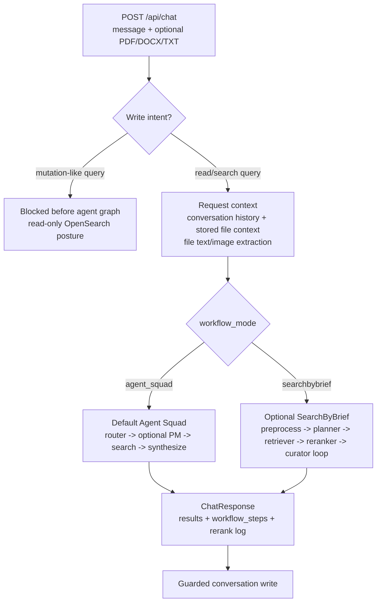
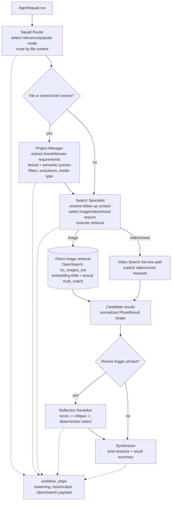
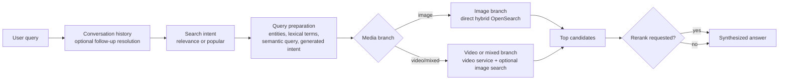
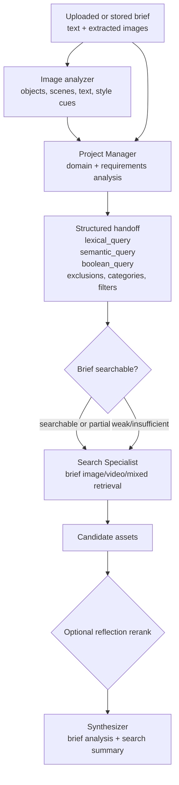
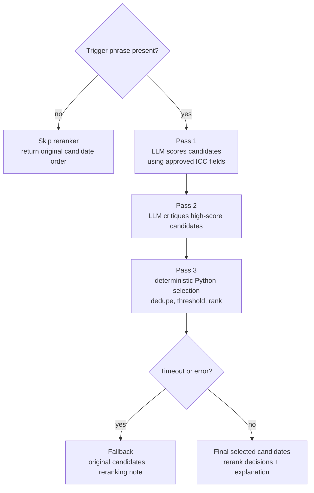
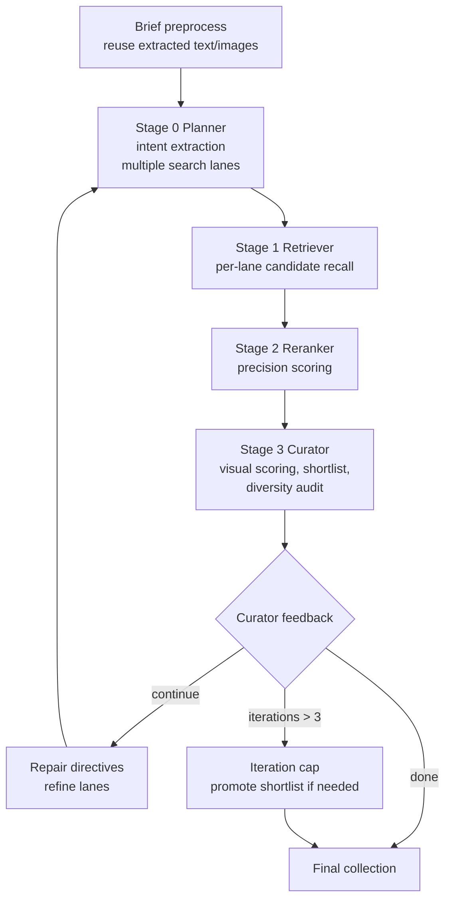

# Gen-Aperture Agentic Workflows

This document describes the agentic search workflows inside Gen-Aperture. It complements the general system diagram in [gen-aperture-architecture.excalidraw.json](gen-aperture-architecture.excalidraw.json) with workflow-focused diagrams and the search patterns each workflow uses.

Editable workflow diagram: [gen-aperture-agentic-workflows.excalidraw.json](gen-aperture-agentic-workflows.excalidraw.json)

## Workflow Summary

Gen-Aperture uses controlled agent graphs rather than an open-ended autonomous agent. The default `agent_squad` workflow is a LangGraph state machine with deterministic routing, specialist agents, direct OpenSearch retrieval, optional reflection reranking, and a final synthesizer. The optional `searchbybrief` workflow is a heavier multi-stage brief search graph with lane planning, candidate recall, precision reranking, and an agentic curation loop.

## Default Agent Squad Workflow

The default path is optimized for conversational stock-photo search. It lets deterministic code make safety and routing decisions, then gives each agent a narrow job.

### Agentic Search Patterns

| Pattern | How Gen-Aperture applies it |
| --- | --- |
| Guard before graph | Write-like queries are blocked before LangGraph runs, keeping the production OpenSearch domain read-only. |
| Deterministic router | The Squad Router uses code-driven routing for file/no-file paths and `relevance` versus `popular` search mode, avoiding an LLM call for basic dispatch. |
| Stateful multi-agent handoff | `AgentState` carries conversation context, extracted file content, requirements, query strings, filters, results, rerank output, and workflow trace between graph nodes. |
| Plan then retrieve | Uploaded briefs go to the Project Manager first; retrieval starts only after the brief is converted into concrete lexical/semantic queries, exclusions, and filters. |
| Hybrid recall | Image search combines semantic query embeddings with lexical `multi_match` against `icc_images_ext`, then maps hits into the shared frontend result shape. |
| Reflection after retrieval | Reflection reranking is a post-retrieval judge pattern, triggered only by phrases such as `best`, `top ranked`, `rerank`, `reflect and respond`, or `reviewed`. |
| Bounded fallback | Agent LLM calls and reranker calls have explicit timeouts. Reranker timeout/error returns original candidates with a note instead of failing the whole chat response. |
| Traceable agent work | Each agent appends `workflow_steps` so the UI can show reasoning, decisions, inputs, outputs, and generated OpenSearch payloads. |

## Text-Only Search Pattern

Text-only search is the shortest Agent Squad path. It uses conversation context to resolve follow-ups, prepares query terms, chooses the media branch, and searches directly.

Pattern notes:

- The agent is not asking a search service to invent an OpenSearch payload for image search. `PhotoSearchService` builds the image query directly.
- The workflow keeps generated payloads visible in the trace so search behavior can be debugged from the UI.
- Reranking words are metadata about selection quality, not search subject terms.

## Brief-Assisted Search Pattern

When a file is uploaded or stored on the conversation, the Project Manager acts as a brief interpreter before retrieval.

Pattern notes:

- This is a decomposition pattern: the brief is split into subject queries, visual requirements, exclusions, named entities, categories, and media intent.
- The Project Manager explicitly separates searchable subjects from style/quality requirements so retrieval is anchored on concrete image subjects.
- Brief warnings can travel to the synthesizer while still allowing a partial search when there is enough signal.

## Reflection Reranker Pattern

The Reflection Reranker is a controlled reflection pattern over already-retrieved candidates.

Pattern notes:

- The LLM judges only the evidence fields available from `icc_images_ext`; the final keep/discard step is deterministic.
- The reranker is intentionally post-retrieval. It improves precision without changing the recall query itself.
- The timeout cap protects the chat endpoint from becoming an unbounded agent loop.

## Optional SearchByBrief Workflow

`workflow_mode=searchbybrief` uses a separate LangGraph path for heavier brief-driven image selection when optional ML dependencies are installed.

Pattern notes:

- This path uses lane decomposition: one brief can become many visual search lanes.
- Retrieval is recall-first, then later stages improve precision and collection quality.
- The curator is the agentic loop controller. It can audit missing attributes or duplicate lanes and send repair directives back to the planner.
- The graph has an iteration guard, so repair is bounded and always returns a final collection or promoted shortlist.

## Pattern-To-Code Map

| Workflow area | Main source files |
| --- | --- |
| Chat request, context loading, workflow mode dispatch | `backend/app/routers/chat.py` |
| Agent Squad LangGraph nodes and state | `backend/app/services/agent_squad.py` |
| Direct OpenSearch image retrieval | `backend/app/services/photo_search.py` |
| Reflection reranking | `backend/app/services/reranker.py` |
| Query intent and refinement helpers | `backend/app/services/query_intent.py`, `backend/app/services/query_refinement.py` |
| Optional SearchByBrief graph | `backend/app/services/searchbybrief/main.py` |
| SearchByBrief stage notes | `backend/app/services/searchbybrief/stages.md` |
| Frontend workflow trace and rerank log | `frontend/src/App.jsx` |
