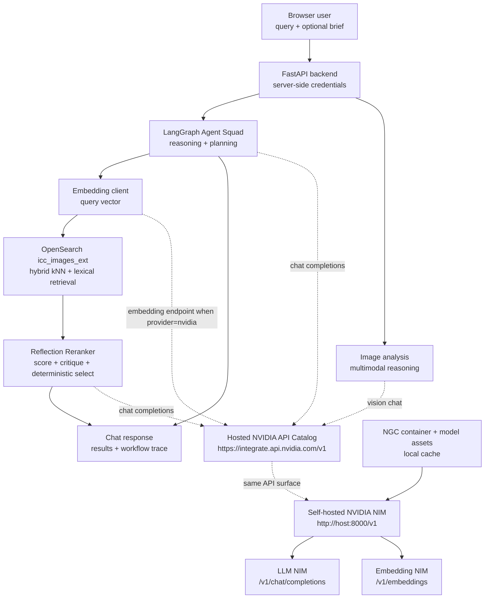
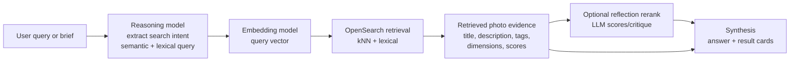

# NVIDIA NIM APIs, Embeddings, Reasoning, and RAG

This document explains how Gen-Aperture uses NVIDIA APIs today, how NVIDIA NIM fits behind those APIs, and how to switch from hosted NVIDIA endpoints to self-hosted NIMs for reasoning and embedding workloads.

Editable block diagram: [nvidia-nim-apis-rag.excalidraw.json](nvidia-nim-apis-rag.excalidraw.json)

Primary NVIDIA references:

- [NIM LLM quickstart](https://docs.nvidia.com/nim/large-language-models/latest/get-started/quickstart.html)
- [NIM LLM prerequisites](https://docs.nvidia.com/nim/large-language-models/latest/get-started/prerequisites.html)
- [NIM LLM architecture overview](https://docs.nvidia.com/nim/large-language-models/1.11.0/introduction.html)
- [NeMo Retriever Embedding NIM API reference](https://docs.nvidia.com/nim/nemo-retriever/text-embedding/latest/reference.html)
- [NeMo Retriever Embedding NIM LangChain RAG playbook](https://docs.nvidia.com/nim/nemo-retriever/text-embedding/latest/playbook.html)

## Current App Usage

Gen-Aperture uses NVIDIA through OpenAI-compatible APIs. In hosted mode, the backend points at:

```text
NVIDIA_BASE_URL=https://integrate.api.nvidia.com/v1
NVIDIA_API_KEY=<server-side key>
```

The same client shape can point at a self-hosted NIM by changing the base URL, for example:

```text
NVIDIA_BASE_URL=http://localhost:8000/v1
```

The app uses NVIDIA-backed reasoning calls for:

| App area | Current model setting | API shape |
| --- | --- | --- |
| Agent Squad router/Project Manager/Search Specialist/Synthesizer | `AGENT_MODEL=meta/llama-3.3-70b-instruct` | OpenAI-compatible chat completions |
| Uploaded image analysis | `IMAGE_ANALYSIS_MODEL=meta/llama-3.2-11b-vision-instruct` | Chat completions with image content blocks |
| Reflection reranker | `RERANK_MODEL=meta/llama-3.2-3b-instruct` | Chat completions, JSON output, timeout-bound |
| Optional SearchByBrief planner/curator | `SEARCHBYBRIEF_MODEL=meta/llama-3.3-70b-instruct` | Chat/vision completions, JSON output |

Query embeddings are configurable. The current default direct image-search path still uses OpenAI embeddings because `icc_images_ext.dense_vector` is a 256-dimensional field. NVIDIA embeddings can be used after backfilling a matching vector field such as `dense_vector_nvidia_384`:

```text
OPENSEARCH_VECTOR_FIELD=dense_vector_nvidia_384
OPENSEARCH_TEXT_EMBEDDING_PROVIDER=nvidia
OPENSEARCH_TEXT_EMBEDDING_MODEL=nvidia/llama-nemotron-embed-1b-v2
OPENSEARCH_TEXT_EMBEDDING_DIMENSIONS=384
OPENSEARCH_TEXT_EMBEDDING_QUERY_INPUT_TYPE=query
OPENSEARCH_TEXT_EMBEDDING_PASSAGE_INPUT_TYPE=passage
OPENSEARCH_TEXT_EMBEDDING_TRUNCATE=END
```

## Block Diagram



## How Reasoning Calls Work

NVIDIA NIM exposes OpenAI-compatible endpoints, so the app can use the existing `openai` Python client and LangChain `ChatOpenAI` client with a NVIDIA base URL.

Minimal reasoning request:

```bash
curl "$NVIDIA_BASE_URL/chat/completions" \
  -H "Authorization: Bearer $NVIDIA_API_KEY" \
  -H "Content-Type: application/json" \
  -d '{
    "model": "meta/llama-3.3-70b-instruct",
    "messages": [
      {"role": "system", "content": "You are a concise search planning assistant."},
      {"role": "user", "content": "Find authentic photos of port workers unloading cargo."}
    ],
    "max_tokens": 300
  }'
```

In this repo:

- `backend/app/services/agent_squad.py` uses `ChatOpenAI(..., base_url=settings.llm_base_url)` for the default LangGraph agents.
- `backend/app/services/image_analyzer.py` uses `OpenAI(..., base_url=settings.llm_base_url)` for multimodal brief-image analysis.
- `backend/app/services/reranker.py` uses `AsyncOpenAI(..., base_url=settings.llm_base_url)` for reflection scoring and critique.
- `backend/app/services/searchbybrief/llm.py` uses the same OpenAI-compatible client for SearchByBrief JSON and vision calls.

## How Embedding Calls Work

NVIDIA's NeMo Retriever Embedding NIM exposes `/v1/embeddings`. For text queries, NVIDIA's docs use `input_type: "query"`; for document or passage vectors, use `input_type: "passage"` or the model-appropriate document type.

Minimal query embedding request:

```bash
curl "$NVIDIA_EMBEDDING_BASE_URL/embeddings" \
  -H "Authorization: Bearer $NVIDIA_API_KEY" \
  -H "Content-Type: application/json" \
  -d '{
    "model": "nvidia/llama-nemotron-embed-1b-v2",
    "input": ["sunlit cargo port workers moving shipping containers"],
    "input_type": "query",
    "modality": "text",
    "embedding_type": "float",
    "encoding_format": "float"
  }'
```

In this repo, query-time embedding is produced by `PhotoSearchService._embed_query_text`. When `OPENSEARCH_TEXT_EMBEDDING_PROVIDER=nvidia`, the code:

1. Uses `NVIDIA_API_KEY` unless `OPENSEARCH_TEXT_EMBEDDING_API_KEY` is set.
2. Uses `NVIDIA_BASE_URL` unless `OPENSEARCH_TEXT_EMBEDDING_BASE_URL` is set.
3. Calls the OpenAI-compatible embeddings client.
4. Adds NVIDIA-specific request metadata such as `input_type=query` and `truncate=END`.
5. Verifies the returned vector length matches `OPENSEARCH_TEXT_EMBEDDING_DIMENSIONS`.
6. Sends that vector to OpenSearch kNN over `OPENSEARCH_VECTOR_FIELD`.

## RAG Flow In This Application

Gen-Aperture's RAG pattern is retrieval over stock image metadata and candidate image records, not a general document-QA RAG chatbot.



The important alignment rule is that query vectors and indexed passage/document vectors must come from the same model family and dimensionality. That is why the app does not switch query-time search to NVIDIA embeddings until the OpenSearch index has a compatible NVIDIA vector field.

## Backfill NVIDIA Embeddings

Dry run first:

```bash
cd backend
python scripts/backfill_nvidia_embeddings.py \
  --index icc_images_ext \
  --vector-field dense_vector_nvidia_384 \
  --model nvidia/llama-nemotron-embed-1b-v2 \
  --dimensions 384 \
  --create-mapping
```

When the sample text and mapping look correct, run the write:

```bash
cd backend
python scripts/backfill_nvidia_embeddings.py \
  --index icc_images_ext \
  --vector-field dense_vector_nvidia_384 \
  --model nvidia/llama-nemotron-embed-1b-v2 \
  --dimensions 384 \
  --create-mapping \
  --execute
```

After the backfill completes, switch runtime query embedding settings to the same vector field, model, and dimension values used by the script.

## Hosted NVIDIA API Catalog Path

Use this path when NVIDIA hosts the NIM endpoints for you.

1. Generate a NVIDIA API key for API Catalog access.
2. Put the key only in `backend/.env` as `NVIDIA_API_KEY`.
3. Keep `NVIDIA_BASE_URL=https://integrate.api.nvidia.com/v1`.
4. Use reasoning models through `/v1/chat/completions`.
5. Use embedding models through `/v1/embeddings` only after the vector index is aligned.

No local model download is needed in this path. NVIDIA operates the model deployment behind the endpoint.

## Self-Hosted NIM Deployment Path

Use this path when you want NIM containers running on your own GPU infrastructure.

### 1. Prepare host access

Official NVIDIA prerequisites include supported NVIDIA GPU hardware, Docker, NVIDIA Container Toolkit, NIM container access through NVIDIA Developer Program or NVIDIA AI Enterprise, and an NGC Personal API Key with at least NGC Catalog access.

Example host check:

```bash
docker run --rm --runtime=nvidia --gpus all ubuntu nvidia-smi
```

### 2. Authenticate to NGC

```bash
export NGC_API_KEY=<your-ngc-personal-api-key>
echo "$NGC_API_KEY" | docker login nvcr.io --username '$oauthtoken' --password-stdin
```

### 3. Configure a local model cache

```bash
export LOCAL_NIM_CACHE=$HOME/.cache/nim
mkdir -p "$LOCAL_NIM_CACHE"
```

Mounting a cache avoids redownloading model assets every time the container restarts.

### 4. Run an LLM NIM

Check NVIDIA's current support matrix or API catalog for the image and tag that match your model and GPU. The shape is:

```bash
export NIM_LLM_IMAGE=nvcr.io/nim/meta/llama-3.1-8b-instruct:<tag>

docker run --gpus=all \
  -e NGC_API_KEY=$NGC_API_KEY \
  -v "$LOCAL_NIM_CACHE:/opt/nim/.cache" \
  -p 8000:8000 \
  "$NIM_LLM_IMAGE"
```

Then point Gen-Aperture at the local NIM:

```text
NVIDIA_BASE_URL=http://localhost:8000/v1
AGENT_MODEL=<served-model-id-from-/v1/models>
```

### 5. Run an embedding NIM

Deploy the embedding NIM on a separate port, for example `8001`, using the current NVIDIA NeMo Retriever Embedding NIM image/tag for the selected model. After it is running:

```bash
curl "http://localhost:8001/v1/models" \
  -H "Accept: application/json"
```

Then point only embedding calls at that service:

```text
OPENSEARCH_TEXT_EMBEDDING_PROVIDER=nvidia
OPENSEARCH_TEXT_EMBEDDING_BASE_URL=http://localhost:8001/v1
OPENSEARCH_TEXT_EMBEDDING_MODEL=<served-embedding-model-id>
OPENSEARCH_TEXT_EMBEDDING_DIMENSIONS=<matching-index-dimensions>
```

### 6. What NIM handles during deployment

NIM packages model serving as a containerized microservice. For model-specific NIMs, NVIDIA documents that the container can automatically download model assets from NGC, use a local cache, inspect the available hardware, select an optimized model profile when available, and expose an OpenAI-compatible REST API. That is the deployment work Gen-Aperture avoids when it uses the hosted API Catalog path.

## Security And Operations Notes

- Keep `NVIDIA_API_KEY`, `NGC_API_KEY`, OpenSearch credentials, and embedding API keys server-side only.
- Do not commit `.env` files, generated payloads containing keys, or Docker login output.
- Use official NVIDIA container images and current support matrix tags.
- Treat model downloads, Docker pulls, and backfills as production-affecting operations; dry run and review first.
- Keep `AGENT_LLM_TIMEOUT_SECONDS`, `RERANK_TIMEOUT_SECONDS`, and `OPENSEARCH_TEXT_EMBEDDING_TIMEOUT_SECONDS` bounded so one model call cannot stall the whole chat path.
- If using model-free NIM with Hugging Face models, follow NVIDIA's warning to review non-NVIDIA model artifacts and code before loading them.
